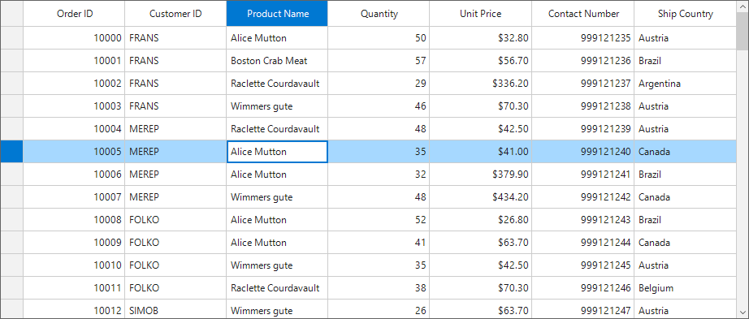

# How to highlight the Row header and Column Header of Current Cell in WinForms DataGrid (SfDataGrid)?

## About the sample

This sample illustrates how to highlight the Row header and Column Header of Current Cell in WinForms DataGrid.

By default in SfDataGrid, the column and row header of the current cell will not be highlighted. You can highlight the column and row header by creating custom renderer for the column header and row header derived from GridHeaderCellRenderer and GridRowHeaderCellRenderer.

```c#
public partial class Form1 : Form
{
    /// <summary>
    /// Initializes the new instance for the Form.
    /// </summary>
    public Form1()
    {
        InitializeComponent();
        sfDataGrid1.DataSource = new OrderInfoCollection().OrdersListDetails;

        sfDataGrid1.CellRenderers["Header"] = new CustomHeaderCellRenderer(this.sfDataGrid1);
        sfDataGrid1.CellRenderers["RowHeader"] = new CustomRowHeaderCellRenderer(this.sfDataGrid1);
        sfDataGrid1.CurrentCellActivated += SfDataGrid1_CurrentCellActivated;

    }

    private void SfDataGrid1_CurrentCellActivated(object sender, Syncfusion.WinForms.DataGrid.Events.CurrentCellActivatedEventArgs e)
    {
        sfDataGrid1.TableControl.Invalidate(sfDataGrid1.TableControl.GetRowRectangle(sfDataGrid1.TableControl.GetHeaderIndex(),false));
    }
}

public class CustomHeaderCellRenderer : GridHeaderCellRenderer
{
    SfDataGrid DataGrid { get; set; }
    public CustomHeaderCellRenderer(SfDataGrid DataGrid)
    {
        this.DataGrid = DataGrid;
    }
    protected override void OnRender(Graphics paint, Rectangle cellRect, string cellValue, CellStyleInfo style, DataColumnBase column, RowColumnIndex rowColumnIndex)
    {
        if (rowColumnIndex.ColumnIndex == DataGrid.CurrentCell.ColumnIndex)
        {
            style.BackColor = ColorTranslator.FromHtml("#0078d2");
            style.TextColor = Color.White;
        }
        else
        {
            style.BackColor = DataGrid.Style.HeaderStyle.BackColor;
            style.TextColor = DataGrid.Style.HeaderStyle.TextColor;
        }
        base.OnRender(paint, cellRect, cellValue, style, column, rowColumnIndex);
    }
}

public class CustomRowHeaderCellRenderer : GridRowHeaderCellRenderer
{
    SfDataGrid DataGrid { get; set; }
    public CustomRowHeaderCellRenderer(SfDataGrid DataGrid)
    {
        this.DataGrid = DataGrid;
    }
    protected override void OnRender(Graphics paint, Rectangle cellRect, string cellValue, CellStyleInfo style, DataColumnBase column, RowColumnIndex rowColumnIndex)
    {
        if (rowColumnIndex.RowIndex == DataGrid.CurrentCell.RowIndex)
            style.BackColor = ColorTranslator.FromHtml("#0078d2");
        else
            style.BackColor = DataGrid.Style.RowHeaderStyle.BackColor;
        base.OnRender(paint, cellRect, cellValue, style, column, rowColumnIndex);
    }
}
```



## Requirements to run the demo
Visual Studio 2015 and above versions
